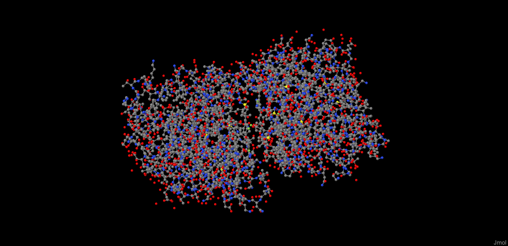

# Задание 3: Визуализация белка

## Белок:

5GMM - Кристаллическая структура карбоангидразы I человека в комплексе с полмакоксибом;
https://www.rcsb.org/structure/5GMM. Файл: [5gmm.pdb](5gmm.pdb)

## Визуализации
### Программа - Jmol
https://jmol.sourceforge.net/
### Использование
Часть вещей удобнее было прописывать и делать в консоли, хотя с помощью правой кнопки мыши по полю, можно использовать
консольный интерфейс. 

В командной консоли многое вида: ``<команда> ON\OFF`` или ``<команда> 125(значение)``
Например ``wireframe 200; spacefill off``. 

Но через GUI (граф. интерфейс) проще настраивать цвета:

Как выглядит изначально в программе:

### Spacefill/cpk

Скриншот:

### Wireframe

Скриншот:

### Backbone

Скриншот:

### Ribbons

Скриншот:

### Molecular Surface

Скриншот:

### Cartoons

Скриншот:

### Не белковая часть (белым цветоом)

Скриншот:

## Публикационные (красивые)

### Публикационная

Скриншот:

### Публикационная 2

Скриншот:

## Литература:

- Консольное руководство: https://chemapps.stolaf.edu/jmol/docs/index.htm?ver=16.2
- Видео-гайд на русском: https://www.youtube.com/watch?v=RFg9fsFMvms&ab_channel=ArthurZalevsky